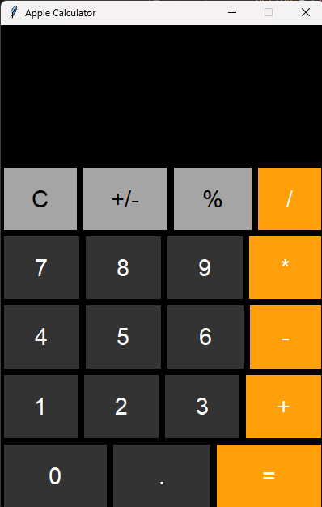

# Calculator Application

## Overview

This project is a GUI-based Calculator Application developed using Python and Tkinter. The application provides a modern and user-friendly interface inspired by contemporary calculator designs while supporting essential arithmetic operations.

## Features

* Addition (+)
* Subtraction (-)
* Multiplication (*)
* Division (/)
* Percentage Calculation (%)
* Positive/Negative Number Toggle (+/-)
* Backspace Function (⌫)
* Clear Display (C)
* Keyboard Input Support
* Error Handling for Invalid Expressions
* Modern Dark Theme Interface

## Technologies Used

* Python 3
* Tkinter
* Visual Studio Code

## Project Structure

Calculator_Project/

├── Calculator.py

├── README.md

├── Screenshots/

└── Presentation.pptx

## How to Run

1. Install Python 3 on your system.
2. Download or clone the project.
3. Open the project folder in Visual Studio Code.
4. Run the following command:

```bash
python Calculator.py
```

5. The calculator window will launch.

## Functionalities

The calculator allows users to:

* Perform basic arithmetic calculations.
* Calculate percentages.
* Enter values using either mouse clicks or keyboard input.
* Delete the most recent character using the backspace button.
* Toggle between positive and negative values.
* Handle invalid inputs gracefully through error messages.

## Application Screenshot




## Output

The application provides a responsive graphical user interface with an Apple-inspired dark theme and intuitive button layout.

## Conclusion

The Calculator Application successfully demonstrates the implementation of Python GUI development using Tkinter. The project combines functionality, usability, and modern interface design while providing an efficient solution for everyday calculations.
